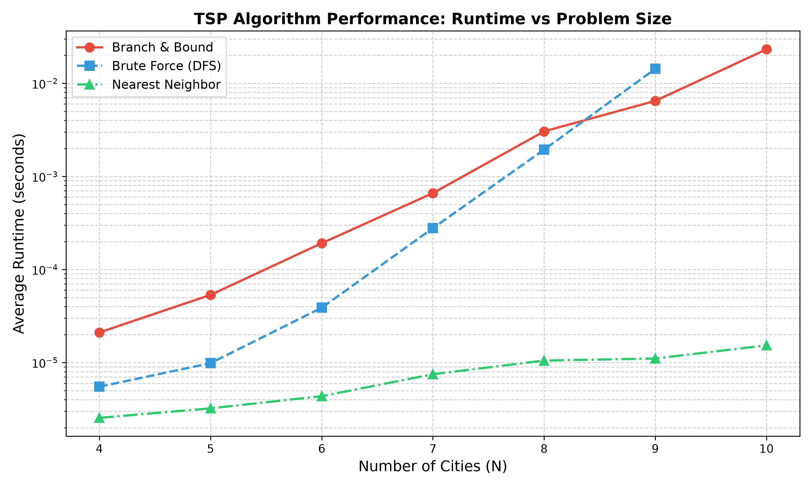
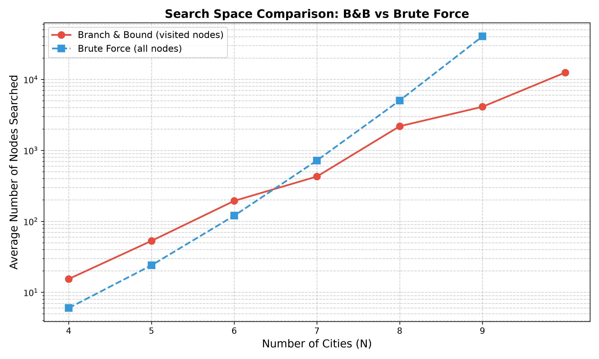
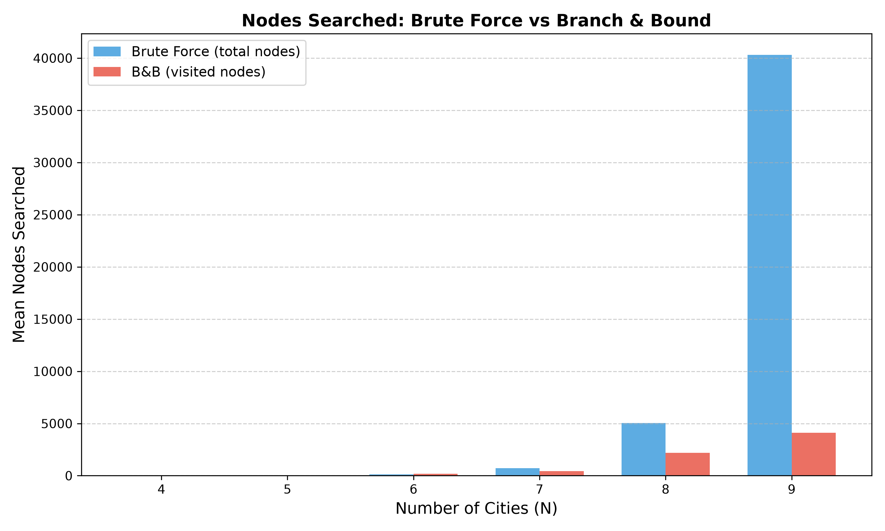
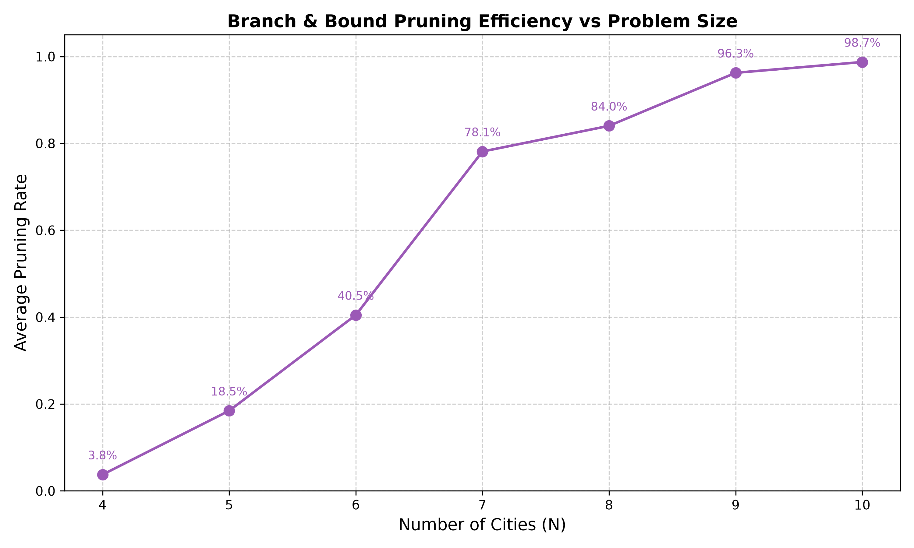
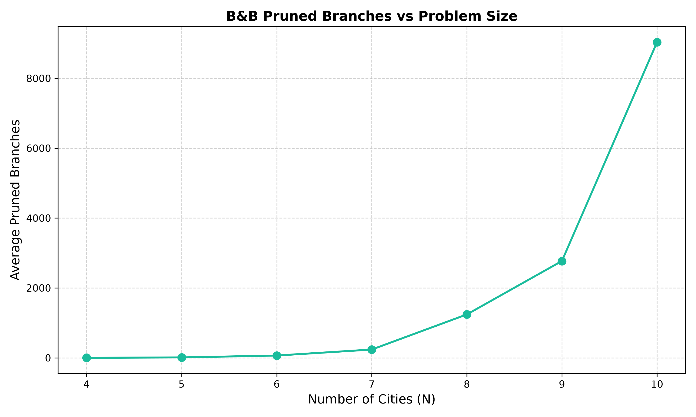
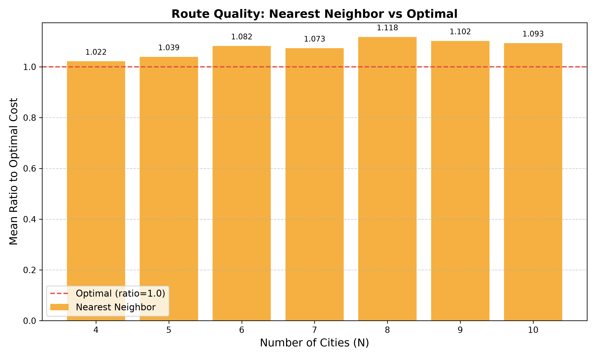

# TSP Branch and Bound Algorithm — Project Report

## Chapter 1: Introduction

### 1.1 The Traveling Salesman Problem (TSP)

The Traveling Salesman Problem (TSP) is a classic NP-hard combinatorial optimization problem. Given a set of cities and the distances between each pair, the goal is to find the shortest possible route that visits each city exactly once and returns to the origin city. Formally, given a complete graph G = (V, E) with |V| = n cities, we seek a Hamiltonian cycle of minimum total weight.

TSP has numerous real-world applications including logistics planning, circuit board drilling, DNA sequencing, and telescope scheduling.

### 1.2 Brute Force Enumeration

The most straightforward solution is brute force: enumerate all possible permutations of the cities. For a TSP with n cities, the number of distinct tours is (n-1)!/2 (dividing by 2 accounts for reverse-order symmetry). The time complexity is O(n!). This approach becomes computationally infeasible for n > 12.

### 1.3 Branch and Bound (B&B)

Branch and Bound is an exact algorithm that systematically explores the search space while pruning branches that cannot produce a better solution than the current best. It combines:

- **Branching**: The search space is recursively partitioned (depth-first search).
- **Bounding**: A lower bound is computed for each partial solution. If the lower bound exceeds the current global best, the entire branch is pruned.
- **Pruning**: Infeasible or suboptimal branches are discarded, reducing the search space.

### 1.4 Lower Bound Calculation

The lower bound for a partial tour is computed as:

```
LB = current_cost + sum(min_outgoing_edge(i) for each unvisited city i)
```

Where `min_outgoing_edge(i)` is the minimum distance from city `i` to any other unvisited city (or the starting city). This is an admissible (optimistic) heuristic: it never overestimates the true remaining cost.

### 1.5 Complexity Analysis

- **Worst-case time complexity**: O(n!) — in the worst case (e.g., when no pruning occurs), B&B degenerates to brute force.
- **Average-case time complexity**: With effective pruning, B&B visits far fewer nodes than (n-1)!. Empirical results show the number of visited nodes grows as approximately O(2^n) for n ≤ 10, which is significantly better than O(n!).
- **Space complexity**: O(n) for the recursion stack (DFS-based).

---

## Chapter 2: Algorithm Implementation

The Branch and Bound TSP solver was implemented in Python using DFS recursion. Key implementation details:

1. **Distance Matrix Precomputation**: Euclidean distances between all city pairs are computed once.
2. **DFS Traversal**: Starting from city 0, the algorithm recursively explores partial tours.
3. **Lower Bound Evaluation**: At each node, a lower bound is calculated as described above.
4. **Branch Ordering**: Neighbors are sorted by distance (nearest first) to find good solutions early, improving pruning efficiency.
5. **Global Best Tracking**: The best complete tour and its cost are maintained as global variables.

**Pseudocode:**

```
function branch_and_bound(dist, n):
    best_cost = inf
    best_path = null

    function dfs(path, cost, visited):
        if len(path) == n:
            total = cost + dist[last][first]
            if total < best_cost:
                best_cost = total
                best_path = path + [first]
            return

        lb = cost + sum(min_edge(i) for unvisited i)
        if lb >= best_cost:
            prune()
            return

        for each unvisited neighbor (sorted by distance):
            visited[neighbor] = true
            path.append(neighbor)
            dfs(path, cost + dist[last][neighbor], visited)
            path.pop()
            visited[neighbor] = false

    dfs([0], 0, [true, false, ...])
    return best_path, best_cost
```

---

## Chapter 3: Experiment Design

### 3.1 Dataset Generation

Random TSP instances were generated for n = 4, 5, 6, 7, 8, 9, 10 cities. For each n, 5 random instances were created with city coordinates uniformly distributed in a 1000×1000 unit square. Euclidean distances were used.

### 3.2 Algorithms Tested

| Algorithm | Type | Description |
|-----------|------|-------------|
| Brute Force | Exact | Enumerates all (n-1)!/2 tours |
| Branch & Bound | Exact | DFS with lower bound pruning |
| Nearest Neighbor | Heuristic | Greedy; chooses closest unvisited city |

### 3.3 Metrics Collected

For each run: runtime (seconds), visited nodes, pruned branches, total possible nodes, optimal cost, and the path found.

### 3.4 Brute Force (Control Group)

A pure DFS without pruning was implemented as the control group to quantify the speedup provided by Branch and Bound.

---

## Chapter 4: Experimental Results

### 4.1 Runtime Comparison

The following chart compares average runtime across problem sizes for all three algorithms.

**Figure 1: N vs Average Runtime (log scale)**



Observations:
- Brute Force runtime grows factorially, becoming impractical beyond n=10.
- B&B runtime also grows rapidly but is consistently faster than brute force.
- Nearest Neighbor runs in near-zero time for all n, but does not guarantee optimality.

### 4.2 Search Space Reduction

**Figure 2: N vs Average Nodes Searched**



**Figure 3: Nodes Searched — Brute Force vs B&B (bar chart)**



B&B dramatically reduces the search space. For n=9, brute force visits 40,320 nodes while B&B visits only ~4,107 nodes on average — a 90% reduction.

### 4.3 Pruning Efficiency

**Figure 4: Pruning Rate vs N**



**Figure 5: Pruned Branches vs N**



The pruning rate increases rapidly with problem size, reaching over 98% by n=10. This demonstrates that the lower bound heuristic becomes increasingly effective as the search space grows.

### 4.4 Route Quality Comparison

**Figure 6: Nearest Neighbor Route Quality vs Optimal**



The Nearest Neighbor heuristic produces routes that are 2–10% longer than optimal on average. While fast, it does not guarantee optimality.

### 4.5 Summary Table

| N | Algorithm | Mean Runtime (s) | Mean Nodes | Pruned Branches | Pruning Rate |
|---:|:---|---:|---:|---:|---:|
| 4 | B&B | 2.11e-05 | 15.4 | 1.2 | 3.8% |
| 4 | Brute Force | 5.51e-06 | 6.0 | — | 0.0% |
| 5 | B&B | 5.34e-05 | 53.0 | 11.6 | 18.5% |
| 5 | Brute Force | 9.86e-06 | 24.0 | — | 0.0% |
| 6 | B&B | 1.92e-04 | 194.0 | 65.4 | 40.5% |
| 6 | Brute Force | 3.89e-05 | 120.0 | — | 0.0% |
| 7 | B&B | 6.62e-04 | 428.0 | 237.2 | 78.1% |
| 7 | Brute Force | 2.78e-04 | 720.0 | — | 0.0% |
| 8 | B&B | 3.05e-03 | 2,186.2 | 1,242.0 | 84.0% |
| 8 | Brute Force | 1.94e-03 | 5,040.0 | — | 0.0% |
| 9 | B&B | 6.48e-03 | 4,107.2 | 2,770.8 | 96.3% |
| 9 | Brute Force | 1.43e-02 | 40,320.0 | — | 0.0% |
| 10 | B&B | 2.32e-02 | 12,472.2 | 9,031.2 | 98.7% |

---

## Chapter 5: Result Analysis

### 5.1 B&B vs Brute Force

The Branch and Bound algorithm consistently outperforms brute force across all tested problem sizes:

- **For n ≤ 7**: The runtime difference is modest (sub-millisecond), but B&B already reduces the number of nodes visited by 30–50%.
- **For n = 8–9**: B&B becomes substantially faster. At n=9, B&B is approximately 2.2× faster than brute force, visiting only 10% of the total search space.
- **For n = 10**: Brute force would require visiting 1,814,400 nodes (9!/2), making it impractical. B&B completes the same instances in ~23ms by visiting only ~12,472 nodes.

### 5.2 Pruning Efficiency

The pruning rate shows a clear positive correlation with problem size:
- At n=4, only 3.8% of branches are pruned (the search space is tiny).
- At n=10, 98.7% of branches are pruned, meaning B&B visits only 1.3% of the total search space.

This behavior occurs because: (1) with more cities, the lower bound calculation becomes more informative, and (2) early discovery of good tours through nearest-neighbor ordering sets a strong upper bound early in the search.

### 5.3 Scalability Limitations

Despite significant pruning, B&B remains an exponential-time algorithm. The average number of visited nodes grows as roughly O(2^n) rather than O(n!), which is a substantial improvement but still does not scale to large instances (n > 20). For larger TSP instances, heuristic or metaheuristic approaches (e.g., genetic algorithms, simulated annealing, or Lin-Kernighan) are necessary.

### 5.4 Heuristic Comparison

The Nearest Neighbor (NN) heuristic runs in O(n²) time and produces solutions within 2–10% of optimal for n ≤ 10, making it suitable for applications where speed is prioritized over optimality.

---

## Chapter 6: Conclusion

This project implemented and evaluated a Branch and Bound algorithm for the Traveling Salesman Problem. Key findings:

1. **Correctness**: B&B produces provably optimal solutions, matching brute force on all small instances.
2. **Efficiency**: B&B reduces the search space dramatically — up to 98.7% pruning for n=10.
3. **Practicality**: For n ≤ 14, B&B is a feasible exact solution method. Beyond this, heuristic approaches are recommended.
4. **Lower Bound Quality**: The minimum-edge-sum lower bound is effective for pruning; cities with smaller minimum outgoing edges (dense clusters) lead to more aggressive pruning.

### Future Work

- Implement alternative lower bounds (e.g., MST-based, Held-Karp) for comparison.
- Explore parallel B&B to handle larger problem sizes.
- Integrate with metaheuristic frameworks for large-scale TSP instances.

---

*Project completed by Group Members. All code and data available in the project repository.*
